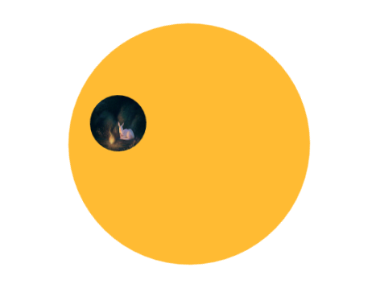

# 这是一个圆盘旋转的动画（基于css3，源于css揭秘第8章）

## 要求：

大圆盘旋转，而小圆盘始终保持自己本身的朝向

## 方法一：

思路：大盘旋转时，小盘也在旋转，方向相反；

<a href="html/旋转圆盘.html">方法一</a>

```
    <style>
        @keyframes spin {
            to {
                transform: rotate(1turn);
            }
        }
        @keyframes spin-revers {
            from {
                transform: rotate(1turn);
            }
        }
        div {
            width: 300px;
            height: 300px;
            background: #fb3;
            border-radius: 100%;
            margin: 100px auto;
            animation: spin 3s infinite linear;
            transform-origin: center 150px;
        }
        img {
            width: 70px;
            height: 70px;
            margin: 50px;
            border-radius: 100%;
            animation: spin-revers 3s infinite linear;
        }
    </style>
```

>注：@keyframes 中，直接写to和form都可以旋转，只是方向相反；

改进：

在img中将`animation: spin-revers 3s infinite linear;`替换成
`animation:inherit;animation-name: spin-revers;`

改进：

`animation:inherit;animation-name: spin-revers;`
替换成
`animation:inherit;animation-derection: reverse;`


方法二 没有看懂。。。。。。。。
<a href="html/旋转圆盘4.html">没有看懂的方法二</a>